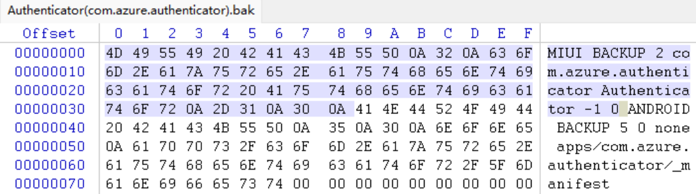
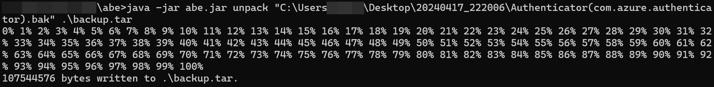

# 利用MIUI / Hyper OS自带备份提取应用数据

> 之前一直在用M\*\*\*\*\*\*\*t Authenticator管理[TOTP](https://en.wikipedia.org/wiki/Time-based_one-time_password)数据（2FA的一种实现），但它太重，启动太慢，而且本地化做得很烂，于是我就想换一个TOTP应用。辗转搜索到[Aegis](https://github.com/beemdevelopment/Aegis)，基于GPL-3.0开源，UI设计得也很不错，而且支持多种导入导出的方式。
>
> 问题来了，Aegis的确支持导入，但是M\*\*\*\*\*\*\*t Authenticator不支持导出啊（微软能不能414）！Aegis支持root方式导入，但我手机没有root啊！那我总不能把所有的2FA全重新申请一遍吧？

> 一番搜索，最终决定从MIUI自带的备份入手，尝试提取数据。总结总结经验，也就有了这篇笔记。

## 备份数据（MIUI Backup）

我们知道，`adb backup`只能备份那种允许你备份（即在`AndroidManifest.xml`中设置了`allowBackup=true`）的应用。但很多国产设备魔改了备份，可以无视这个限制调用相关API。

[Android Backup Extractor](https://github.com/nelenkov/android-backup-extractor)是一个能够解包`adb backup`导出的备份的项目。

备份文件位于/sdcard/MIUI/backup内。我们最后只需要这一个`.bak`文件，它包含APK和数据。

## 提取数据（Android Backup Extractor）

用WinHex或者随便什么Hex编辑器打开这个`.bak`文件，不难发现其在`Android Backup`的基础上添加了一个Magic Header。

不妨假设`.bak`文件只添加了Magic Header，那可以试试删除掉之后喂给`Android Backup Extractor`。

果然是可行的。找到我们需要的文件，再导入到Aegis中就可以了。